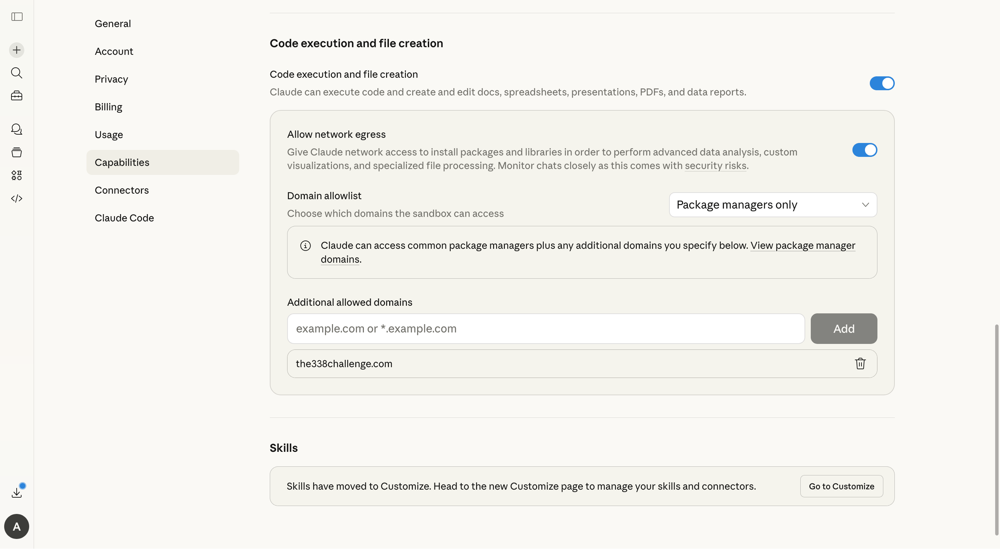
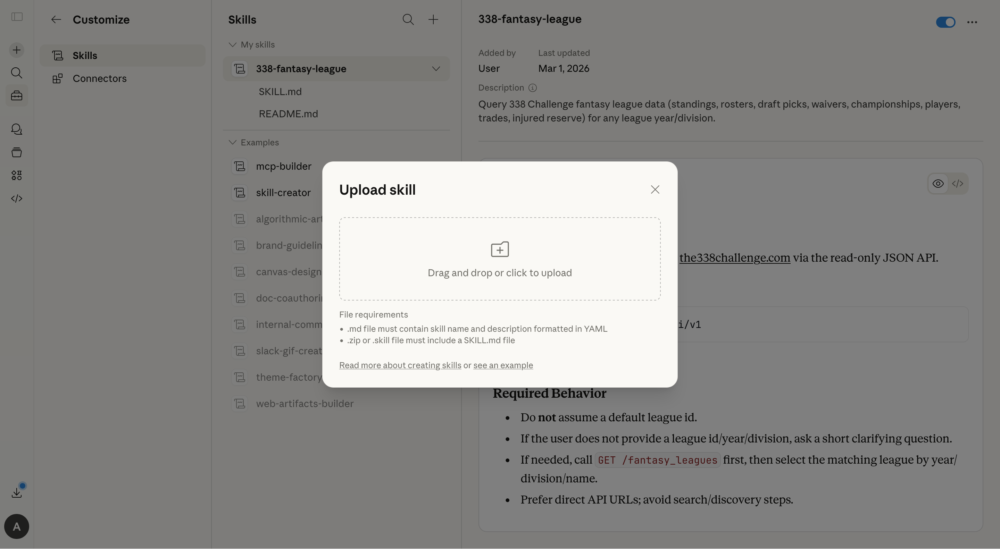
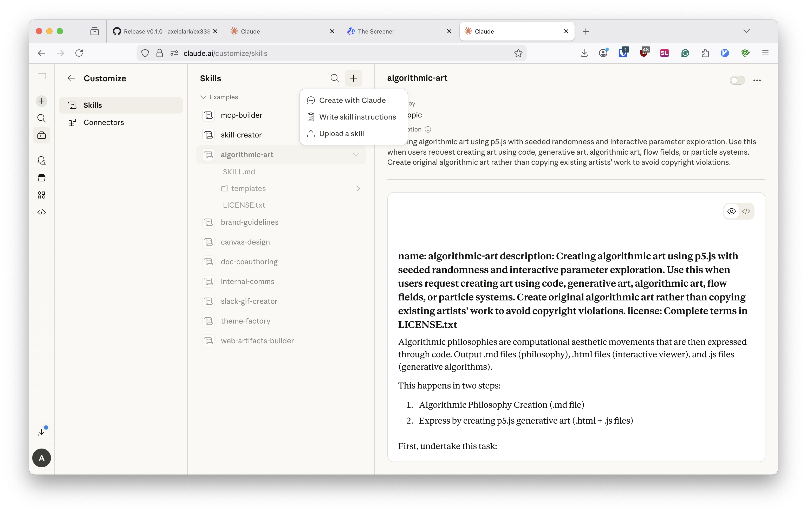

# 338-fantasy-league-skill

Skill for querying 338 Challenge fantasy league data via the public read-only API.

## Setup (Claude)

1. **Enable required capabilities**
   - Open **Settings → Capabilities**
   - Turn on **Code execution and file creation**
   - Turn on **Allow network egress**
   - For domains, either:
     - set allowlist to **All domains**, or
     - add: `the338challenge.com`

   

2. **Upload the skill ZIP**
   - Open **Customize → Skills**
   - Click **+** then **Upload a skill**
   - Upload `338-fantasy-league-skill.zip`
   - Reusable latest-download link:
     - `https://github.com/axelclark/338-fantasy-league-skill/releases/latest/download/338-fantasy-league-skill.zip`

   
   

3. **Use the skill in prompts**
   - Ask Claude to use the `338-fantasy-league` skill for standings, rosters, available players, waivers, draft picks, etc.

## Contents
- `SKILL.md` — skill definition and usage
- `scripts/package-skill.sh` — creates distributable zip for Claude skill upload

## Package for upload

```bash
./scripts/package-skill.sh
```

Output:
- `dist/338-fantasy-league-skill.zip`

## Troubleshooting

### 403 / blocked domain / `host_not_allowed`
- Confirm `the338challenge.com` is in your allowlist (or use All domains).
- Start a fresh chat/session and retry.

### It keeps picking the wrong league
- This skill is league-agnostic.
- Ask with a specific league id/year/division, or ask Claude to list leagues first.
